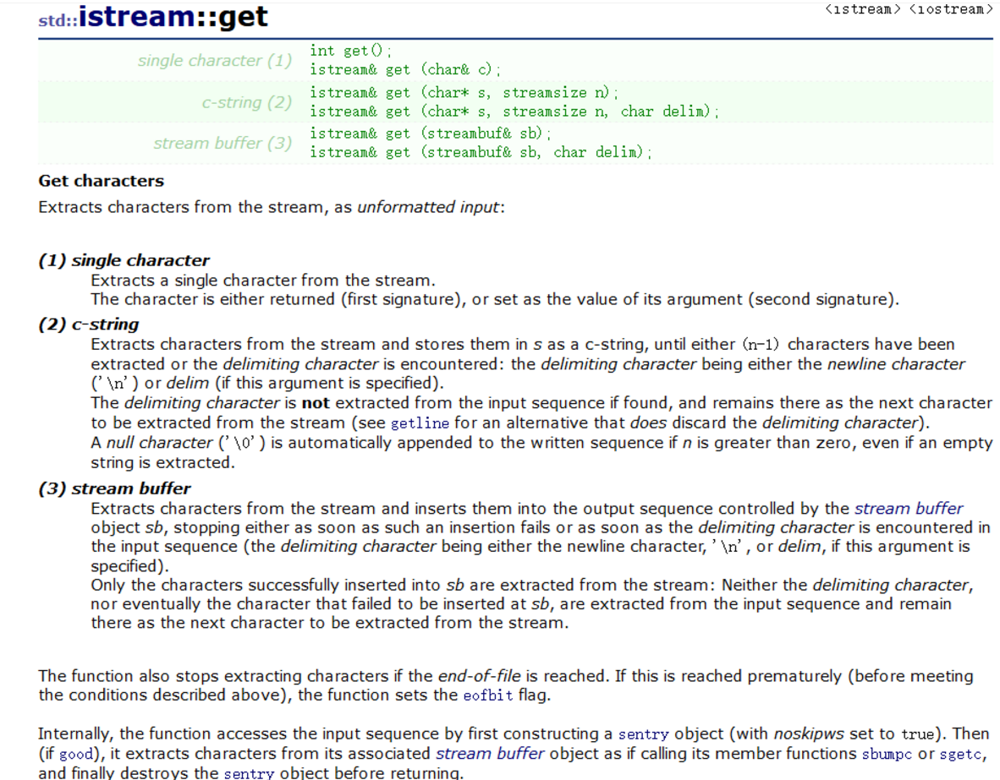

## IO库类型

头文件 | 读 | 写 |读写
---|---|---|---
iostream | istream | ostream | iostream
fstream | ifstream | ofstream | fstream
sstream | istringstream | ostringstream | stringstream

wistream wcin wcout....前加w表示宽字符版，对应wchar_t

* fstream stringstream 继承自iostream
* ifstream istringstream 继承自istream
* ......

IO对象不能赋值和拷贝，一般传递引用。**读写一个IO对象会改变其状态，所以引用不能是const的。**

## 流的状态条件
* strm::iostate 类型，描述流的状态
* strm::badbit  流已崩溃，不能再使用
* strm::failbit 一个IO操作失败
* strm::eofbit 文件尾
* strm::goodbit 正常状态
* s.eof()
* s.fail()
* s.good()
* s.clear() s.clear(flags) 清空条件状态位复位
* s.setstate(flags) 置位
* s.rdstate()       返回条件状态，iostate类型

## 缓冲区
* endl 换行并刷新缓冲区
* flush 刷新缓存区
* ends 输出空格并刷新缓冲区
* unitbuf 设置为每次写操作都刷新缓冲区
* nounitbuf 取消设置↑

### 关联
任何对输入流的读取都会刷新其关联的输出流。cin/cout默认关联
* in_s.tie()  返回该输入流绑定的输出流
* in_s.tie(&out_s)  绑定out_s

## 文件流
* fstream fstrm(file_path,mod) 
    * mod 文件模式:
    * in
    * out
    * app 追加
    * ate 打开后立即定位到文件尾
    * trunc 截断文件（out默认截断）
    * binary 以二进制方式进行IO
* fstrm.open(file_path)
* fstrm.close()
* fstrm.is_open()

## string流
支持内存IO
* stringstream strm;
* stringstream strm(s); strm流保存s的**拷贝**
* stringstream strm(s,mod); mod与fstream的相同
* strm.str(); 返回流中储存的string
* strm.str(s); 把s拷贝到流中

## istream 输入流的操作
* get() 返回单个字符
* get(char&) 读取一个字符，返回该流对象
* getline(buf, n) 读取一行到char* buf
* read(buf, n) 读取n个字符
* peek() 查看而不读取

#### get操作

