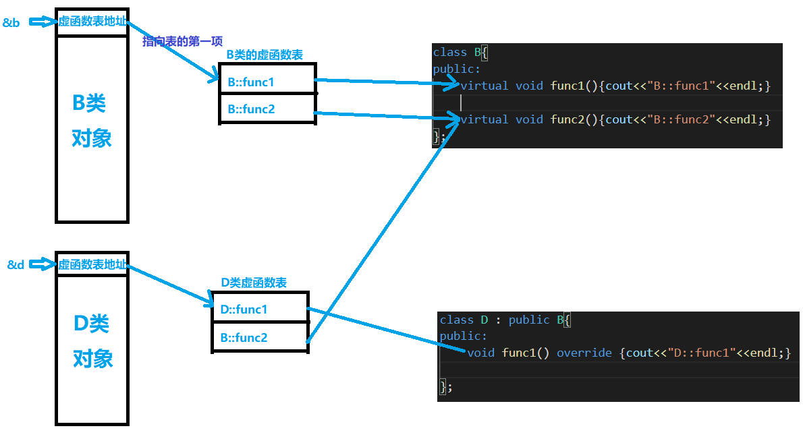

### 虚函数表
C++多态的实现方式。
```c++
class B{
public:
    virtual void func1(){cout<<"B::func1"<<endl;}
    virtual void func2(){cout<<"B::func2"<<endl;}
};

class D : public B{
public:
    void func1() override {cout<<"D::func1"<<endl;}
};


int main(){
    typedef void (*Func)();
    D d;
    Func* vtptr = *(Func**)&d;          //c对象内存中最前端 储存虚函数表的地址，获取虚函数表的地址(其首项的地址)
    Func f1 = vtptr[0];                 //表中第一个虚函数指针
    Func f2 = vtptr[1];                 //表中第二个虚函数指针
    f1();
    f2();
}
//output:
//D::func1
//B::func2
```

通过基类指针调用虚函数时，通过对象的头部找到其类的虚函数表。再从虚函数表中找到实际调用的函数。