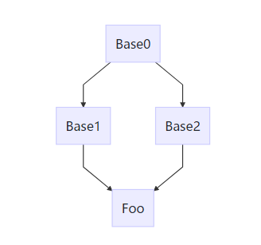

 面向对象程序设计基于**数据抽象、继承、动态绑定**这三个基本概念。

* OOP的核心思想：多态性(polymorphism)
* 继承(inheritance)
* 基类(base class)
* 直接基类(direct base)
* 间接基类(indirect base)
* 派生类(derived class)
* 虚函数(virtual function) 其解析过程发生在运行时，而不是编译时
* 类派生列表(class derivation list)
* 动态绑定(dynamic binding) **使用基类的引用或指针调用一个虚成员函数时会执行动态绑定，使用指针调运虚成员函数时，根据指针所指向的实际对象来 。** 在运行时选择函数的版本
* 覆盖(override)
* 访问说明符(public, protected, private):控制派生类从基类继承而来的成员是否**对派生类的用户**可见
* 共有(public)继承时，才能把派生类型的对象绑定到基类的引用或指针上
* 在形参列表、const修饰符、引用限定符后面添加**override**关键字，来显示地注明它是覆盖了它继承的虚函数
* static 成员在继承体系中唯一存在
* 派生类的作用域嵌套在基类的作用域中
* **final**类名后添加final关键字，禁止进程该类

## 类型转换
* 静态类型（static type）
  * 编译时已知的，指针/引用对应的类型
  * **决定那些成员是可见的**
* 动态类型（dynamic type）
  * 内存中对象的实际类型，运行时可知
  * **决定调用的版本**
* 如果表达式不是引用或指针，则它的动态类型和静态类型一致
* 不存在从基类到派生类的隐式类型转换
  * **当基类含有一个或多个虚函数时**，可使用dynamic_type<T&>( )/dynamic_type<T*>( )对尝试将 *基类指针/引用* 转换 *派生类指针/引用*
  * dynamic_type<T&>(t) 转换引用失败时抛出bad_cast
  * dynamic_type<T*>(t) 转换指针失败时返回空指针
* 自动类型转换只对指针和引用有效，在派生类类型和基类类型之间不存在
* **切掉(sliced down)**: 用派生类对象为一个基类对象初始化或赋值时，只有该派生类的对象中的基类部分会被拷贝、移动、赋值。

## 虚函数
* **基类中虚函数的返回值类型为类本身的引用或指针时，（派生类到基类的类型转换时可访问的时）派生类中的该虚函数可以与基类中的返回值不同，可返回自己的指针/引用。**
* **final修饰符（位于const 、引用修饰符后）**：禁止该虚函数被覆盖。
* 使用作用域运算符指定版本
* **纯虚函数** =0
* 含有纯虚函数的类是**抽象基类(abstract base class)**，**不能创建其对象**。

## 访问控制
* 派生类的成员或友元只能通过派生类对象来访问基类的protected成员
* 派生说明符只影响派生类的用户，对派生类无影响。
* **只有在可以访问基类的共有成员时，派生类向基类的类型的转型才是可访问的。**
* 派生类可以使用using声明改变**其可访问的基类成员**在该基类中的访问权。
* ！！名字查找优先于类型检查，**即使派生类成员和基类成员的形参列表不一致，同名基类成员也会被隐藏(要么不隐藏，要么全部隐藏）**
  * 可以使用using声明，将基类中的名字添加到该作用域，避免全部覆盖掉
```c++
class B{
    public:
        void func(int a){ }

        void func(){ }
};

class D : public B{
    public:
        //加上：using B::func;  才能d.func();
        void func(int a){ }
};

int main(){
    D d;
    d.func();   //错误无法访问
}
```

## 多重继承
* 基类的构造顺序与派生列表中基类的出现顺序保持一致
* 析构顺序正好与构造顺序相反
* 如果从多个基类继承了相同的构造函数（形参相同），将产生错误。这个类必须为该构造函数定义它自己的版本。
* **派生类如果定义自己的拷贝/赋值构造和赋值运算符，必须在完整的对象上执行拷贝、赋值或移动，不要忘记处理其基类的赋值（直接基类和间接基类）。派生类的合成版本会自动完成对其基类部分的操作。**
* 任意的public继承的基类的指针可以指向一个派生类对象（都一样好）。
* 指针和引用的静态类型决定了通过它能够访问那些成员。
* 派生类的作用域嵌套在直接基类和间接基类的作用域中，名字的查找将由内向外。
### 虚继承
* 派生类可以通过它的两个间接基类分别继承同一个间接基类；或直接继承+间接继承一个基类
* **如果一个类在继承过程中出现多次，则派生类中将包含该类的多个子对象**



```
#include<iostream>
using namespace std;

class Base0{
    public:
        int a;
};

class Base1 : public Base0{
    public:
        int b;
};

class Base2 : public Base0{
    public:
        int b;
};

class Foo : public Base1, public Base2{
    public:
       int c;
};

int main() {
    Foo f;
    f.a;            //错误
    f.b;            //错误
    Base0& b = a;   //错误
}
```
* **虚继承**解决上述问题，令某个类共享它的基类。共享的基类子对象称为**虚基类(virtual base class)**，不论虚基类在继承体系中出现了多少次，在派生类中都只包含唯一一个共享的虚基类子对象。
```
#include<iostream>
using namespace std;

class Base0{
    public:
        int a;
};

class Base1 : public virtual Base0{
    public:
        int b;
};

class Base2 : public virtual Base0{
    public:
        int b;
};

class Foo : public Base1, public Base2{
    public:
       int c;
};

int main() {
    Foo f;
    f.a;            //正确
    f.b;            //错误
    Base0& b = f;   //正确
}
```
* Foo对象只包含一个Base0的子对象
* **虚基类之影响从指定了虚基类的派生类中进一步派生出的类，不影响派生类本身**
* 虚派生中，基类由最底层的派生类初始化。
* 含有虚基类的对象的构造顺序：
    * 先构造虚基类，最底层派生类构造函数构造提供初始值构造虚基类（或默认初始化）
    * 有多个虚基类，按派生列表中出现的顺序构造
    * 再按照基类在派生列表中出现的次序初构造
* 合成的拷贝和移动函数、赋值运算符也按该顺序
* 销毁顺序与构造顺序相反